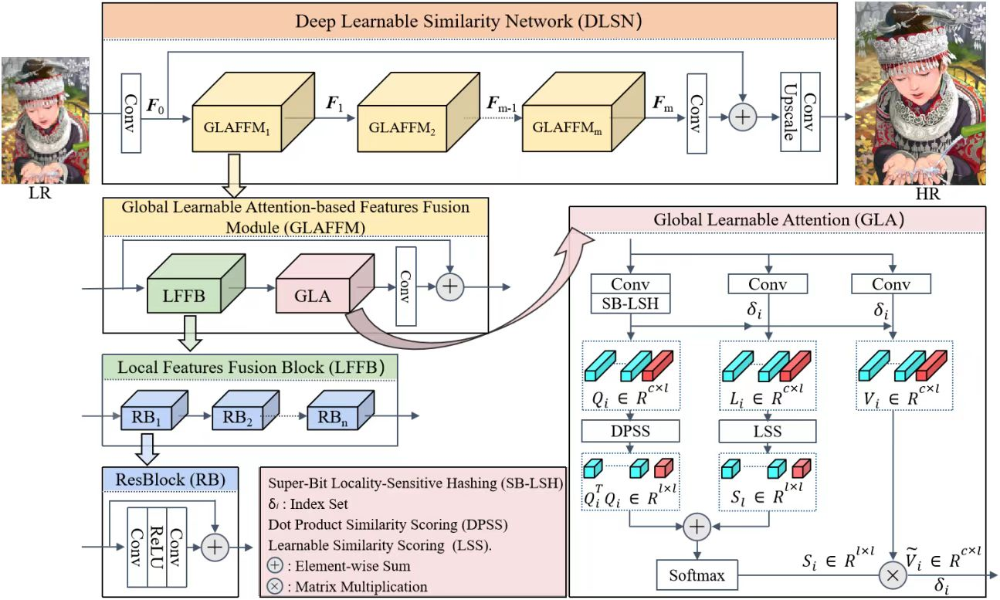

# Global Learnable Attention for Single Image Super-Resolution
This project is for DLSN introduced in the following paper "Global Learnable Attention for Single Image Super-Resolution", submitted to IEEE TPAMI. (Accept (10-Dec-2022))

The code is test on Ubuntu 16.04 environment (Python3.6, PyTorch >= 1.1.0) with Nvidia 3090 GPUs. 
## Contents
1. [Introduction](#introduction)
2. [Train](#train)
3. [Test](#test)
4. [Visual Results](#results)
5. [Acknowledgements](#acknowledgements)

## Introduction

Self-similarity is valuable for exploring non-local textures in single image super-resolution (SISR). Researchers usually assume that the importance of non-local textures is positively related to their similarity scores. In this paper, we surprisingly find that low-similarity non-local textures may provide more accurate and richer details than the high-similarity ones, especially when the query textures are severely damaged. Utilizing this finding, we propose a Global Learnable Attention (GLA) to adaptively modify similarity scores of non-local textures during training instead of only using a fixed similarity scoring function such as the dot product. The proposed GLA can explore non-local textures with low-similarity but more accurate details to repair severely damaged textures. Furthermore, we propose to adopt Super-Bit Locality-Sensitive Hashing (SB-LSH) as a preprocessing method for our GLA. With the SB-LSH, the computational complexity of our GLA is reduced from quadratic to asymptotic linear with respect to the image size. In addition, the proposed GLA can be integrated into existing deep SISR models as an efficient general building block. Based on the GLA, we construct a Deep Learnable Similarity Network (DLSN), which achieves state-of-the-art performance for SISR task of different degradation types (e.g. blur and noise) both quantitatively and qualitatively.


Deep Learnable Similarity Network (DLSN).

## Train
### Prepare training data 

1. Download the training data (800 training + 100 validtion images) from [DIV2K dataset](https://data.vision.ee.ethz.ch/cvl/DIV2K/) or [SNU_CVLab](https://cv.snu.ac.kr/research/EDSR/DIV2K.tar).

2. Unzip the training data into the folder '../SrTrainingData'.

3. Specify '--dir_data' based on the HR and LR images path. 

For more informaiton, please refer to [EDSR(PyTorch)](https://github.com/thstkdgus35/EDSR-PyTorch).

### Begin to train

1. Cd to 'src', run the following script to train models.

    **Example command is in the file 'demo.sh'.**

    ```bash
    # Example X3 SR
    python main.py --dir_data ../../SrTrainingData --data_range 1-800/1-5 --n_GPUs 1 --rgb_range 1 --chunk_size 128 --n_hashes 3 --save_models --lr 1e-4 --decay 300-600-900-1200 --epochs 1500 --chop --save_results --data_test Set5 --n_resgroups 10 --n_resblocks 4 --n_feats 256 --reduction 4 --res_scale 0.1 --batch_size 16 --model DLSN --scale 3 --patch_size 144 --save DLSN_x3 --data_train DIV2K

    ```

## Test
### Quick start
1. Download the pre-trained DLSN with scale factor 3 from [BaiduYun](https://pan.baidu.com/s/1EEkNZ9FieZDnFHSILWhH9A?pwd=udgx) or [GoogleDrive](https://drive.google.com/file/d/1uZRVWhQ-bo8c9eEjpdE5fLVDeIpTE1pn/view?usp=sharing) and place it in '/experiment/DLSN_x3/model'.
2. Place the original test sets (e.g., Set5, other test sets are available from [GoogleDrive](https://drive.google.com/drive/folders/1xyiuTr6ga6ni-yfTP7kyPHRmfBakWovo) ) in '../SrBenchmark'.
3. Cd to 'src', run the following scripts.

    **Example command is in the file 'demo.sh'.**

    ```bash
    # Test on Set5, Set14, B100, Urban100, Manga109 datasets.
    # Example X3 SR
    python main.py --dir_data ../../ --data_test Set5+Set14+B100+Urban100+Manga109 --n_GPUs 1 --rgb_range 1 --save_models --save_results --n_resgroups 10 --n_resblocks 4 --n_feats 256 --res_scale 0.1 --model DLSN --pre_train ../experiment/DLSN_x3/model/DLSN_x3.pt --save Temp --data_range 1-800/1-5 --scale 3 --test_only --reduction 4 --chunk_size 128 --n_hashes 3 --chop
    ```

## Visual Results
Visual results on Urban100 and Manga109 with scale factor 4 are available from [BaiduYun](https://pan.baidu.com/s/1LUPwhtbE1ySrHVSH1Bo3Og?pwd=ip0c) or [GoogleDrive](https://drive.google.com/drive/folders/1_NgMFcPk2G6ccZ-QQiG06KqNadi_7Z8J?usp=share_link).

## Acknowledgements
This code is built on [EDSR (PyTorch)](https://github.com/thstkdgus35/EDSR-PyTorch). We thank the authors for sharing their codes.
